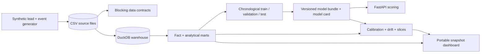

# Nyxora Outcome Intelligence

[](https://www.python.org/)
[](LICENSE)

An end-to-end analytics and machine-learning portfolio system built by **Russell York**. It turns
reproducible synthetic lead events into a DuckDB warehouse, funnel metrics, a booking-propensity
model, drift monitoring, an operational dashboard, and a guarded FastAPI scoring service.

This project intentionally uses classical machine learning rather than an LLM. The goal is to
demonstrate SQL, data contracts, chronological evaluation, probability calibration, model
monitoring, API engineering, testing, and honest communication of limitations.

> **Project status:** v0.1 synthetic portfolio release. No real clinic or customer data is used.
> Scores support human prioritization; they do not automate outreach or establish causality.

**Portfolio link:** [View the recorded outcome dashboard](https://ryork67677.github.io/nyxora-outcome-intelligence/).

## What the system answers

> Which leads may deserve attention now, why, and how confident is the system?

- Funnel and conversion performance by month, channel, and campaign
- Booking probability after a fixed 24-hour observation window
- Priority ranking based on predicted probability and synthetic opportunity value
- Counterfactual scenario deltas for response time, follow-up, and consent
- Calibration, permutation importance, channel slices, and feature-distribution drift
- Explicit data-quality failures before training or dashboard generation

## Architecture



See [the architecture guide](docs/architecture.md), [data dictionary](docs/data_dictionary.md),
and [metric definitions](docs/metric_definitions.md) for the detailed contracts.

## Quick start

Requirements: Python 3.11 or newer and Node.js only if regenerating the packaged portable
dashboard with the OpenAI Data Analytics artifact builder.

```powershell
python -m venv .venv
.venv\Scripts\Activate.ps1
python -m pip install -e ".[dev]"
nyxora-intel build
nyxora-intel serve
```

Open:

- Dashboard: `http://127.0.0.1:8000/`
- API documentation: `http://127.0.0.1:8000/docs`
- Health check: `http://127.0.0.1:8000/health`

The `build` command performs the entire reproducible workflow with a fixed seed: generate 10,000
leads, create event records, build DuckDB tables, enforce data contracts, train and evaluate two
models, score current candidates, calculate monitoring signals, and generate the dashboard
snapshot. The checked-in [portable dashboard](artifacts/dashboard.html) is self-contained.

## Example score request

```powershell
$body = @{
  channel = "referral"
  campaign = "referral_circle"
  service_type = "injectables"
  region = "northeast"
  consent_to_contact = $true
  is_returning = $false
  response_minutes = 42
  follow_up_count = 2
  estimated_value = 850
  created_weekday = "tuesday"
  created_hour = 14
} | ConvertTo-Json

Invoke-RestMethod -Method Post -Uri http://127.0.0.1:8000/v1/score `
  -ContentType "application/json" -Body $body
```

The response includes a probability, risk band, priority score, human-review action, and up to
three model-scored counterfactual scenarios. A counterfactual delta is not a promise that changing
that field will cause the outcome to change.

## Model methodology

- **Prediction point:** 24 hours after lead creation
- **Target:** consultation booked within 14 days
- **Training population:** only leads with a complete 14-day outcome window
- **Split:** oldest 70% train, next 15% validation, newest 15% untouched test
- **Candidates:** logistic regression and histogram gradient boosting
- **Selection:** validation ROC AUC, then Brier score as a tie-breaker
- **Threshold:** selected on validation F1; probability metrics remain threshold-independent
- **Baselines:** constant-prevalence probability and both candidate models
- **Interpretation:** permutation importance and operational counterfactual scenarios

The generated [model card](artifacts/model_card.md) records the exact run, holdout results, intended
use, and limitations.

## Verified default build

Verified locally on July 14, 2026 with the default seed and 10,000 synthetic leads:

| Check | Result |
|---|---:|
| Synthetic lifecycle events | 36,173 |
| Blocking data contracts | 9/9 passed |
| Matured model rows | 9,587 |
| Selected holdout ROC AUC | 0.686 |
| Naive ROC AUC | 0.500 |
| Selected holdout average precision | 0.667 |
| Naive average precision | 0.481 |
| Selected holdout Brier score | 0.221 |
| Naive Brier score | 0.250 |
| Automated tests | 13 passed |
| Measured core coverage | 96% |

The [validation report](artifacts/validation_report.md) records the reconciliation, API/container
smokes, and the remaining browser-verification caveat for the portable dashboard.

## Test and verify

```powershell
ruff check .
pytest
nyxora-intel build --skip-dashboard-package
```

Tests cover deterministic generation, relational integrity, data contracts, mart reconciliation,
chronological model evaluation, scoring behavior, API validation, and dashboard snapshot content.

## Docker

```powershell
docker compose up --build
```

The container rebuilds the deterministic analytical artifacts before serving the dashboard and
API on port 8000.

## Repository map

```text
src/        generation, warehouse, modeling, monitoring, scoring, API, and CLI
sql/        reviewed DuckDB source, fact, and mart transformations
tests/      unit, contract, integration, and API tests
docs/       architecture, metric definitions, data dictionary, and ADRs
artifacts/  portable dashboard, evaluation metrics, monitoring report, and model card
data/       generated raw files and local DuckDB warehouse (ignored by Git)
```

## Honest scope

This repository is educational portfolio software. Its synthetic generator deliberately contains
learnable relationships, so the reported accuracy is evidence that the engineering pipeline works,
not evidence of real-world business performance. A pilot would require reviewed real data,
privacy and security controls, fairness analysis, stakeholder-approved metrics, access controls,
alert ownership, and prospective validation before any operational decision relied on a score.
